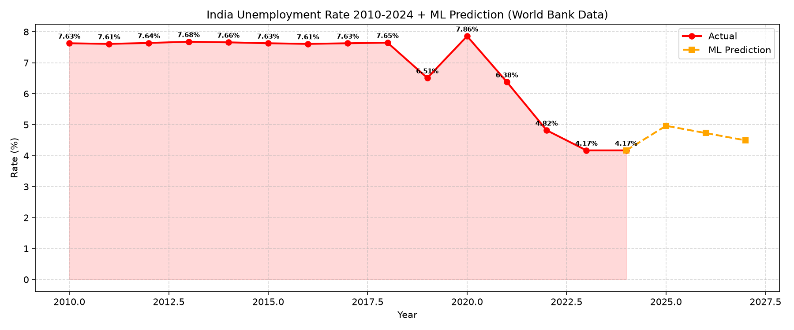
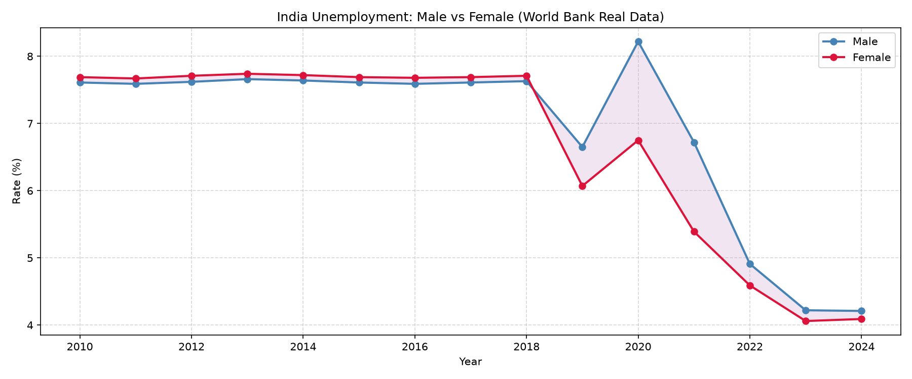
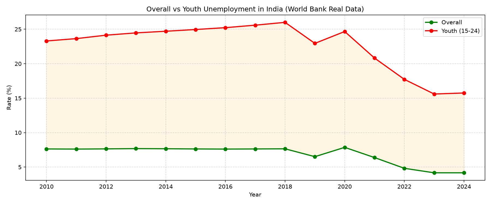
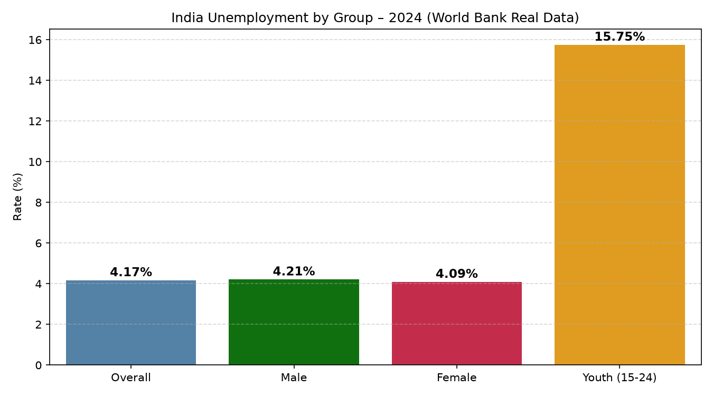
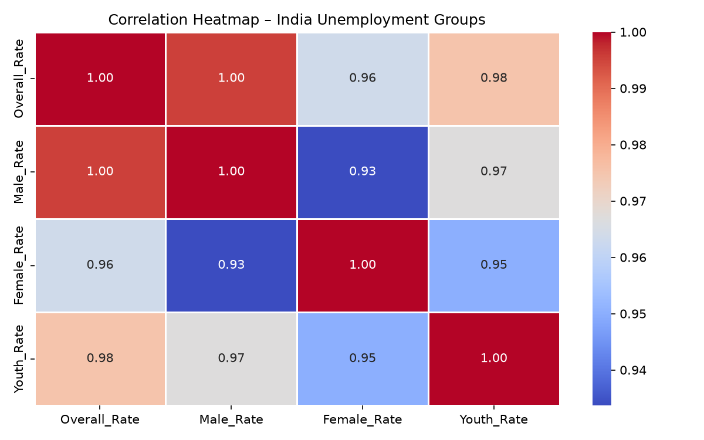
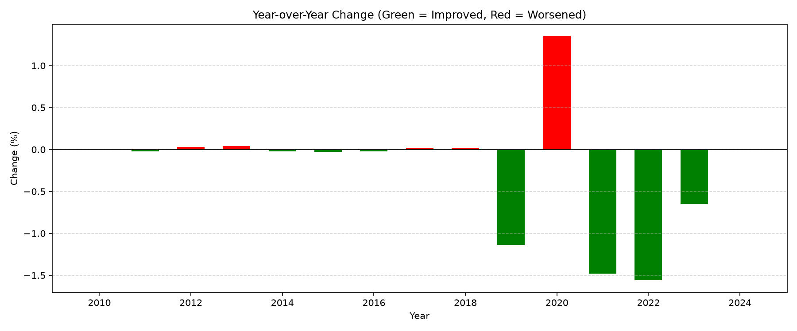
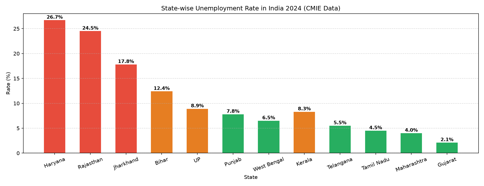
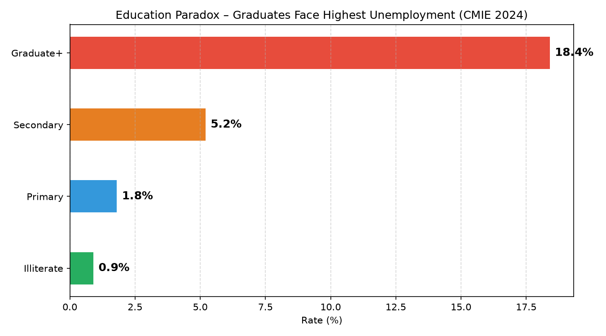

# 📊 India Unemployment Analysis (2010–2024)

> **Real data from World Bank API | Python | Pandas | Matplotlib | Seaborn | Scikit-learn | ML Prediction**

---

## 🔍 Problem Statement

Despite being one of the fastest-growing economies, India faces a serious unemployment challenge. A large youth population, education-jobs mismatch, and gender gap affect millions of families every year.

This project analyzes **real India unemployment data (2010–2024)** from the **World Bank Open Data API**, broken down by gender, age, education, and state — and uses **Machine Learning** to predict future trends.

---

## 🎯 Objectives

| # | Question |
|---|---|
| Q1 | How has unemployment changed from 2010 to 2024? |
| Q2 | Which gender is more affected? |
| Q3 | Which age group faces the highest unemployment? |
| Q4 | Does more education guarantee a job in India? |
| Q5 | Which states have the highest/lowest unemployment? |
| Q6 | Is urban or rural unemployment higher? |
| Q7 | What will unemployment look like in 2025–2027? |

---

## 📁 Project Structure

```
india-unemployment-analysis/
├── Dataset/
│   └── india_unemployment_real.csv   ← Real World Bank data
├── Python/
│   └── unemployment_analysis.py      ← Full analysis code
├── Images/
│   └── (8 charts)
└── README.md
```

---

## 🗂️ Dataset

| Detail | Info |
|---|---|
| Source | [World Bank Open Data](https://data.worldbank.org) + CMIE |
| Rows | 15 (2010–2024) |
| Columns | Year, Overall Rate, Male Rate, Female Rate, Youth Rate |
| Format | CSV |

---

## 🛠️ Tools & Technologies

- **Python** — Core language
- **Pandas** — Data loading & manipulation
- **Matplotlib** — Charts & visualizations
- **Seaborn** — Heatmap & styled charts
- **Scikit-learn** — Linear Regression ML model
- **Statistics** — Mean, Median, Std Dev
- **Git & GitHub** — Version control

---

## 🧹 Data Cleaning

- ✅ No missing values
- ✅ No duplicate rows
- ✅ All columns are numeric
- ✅ COVID-19 spike (2020) confirmed as real data, not an error

---

## 📈 EDA – Summary Statistics

| Metric | Value |
|---|---|
| Mean Rate | 6.84% |
| Median Rate | 7.63% |
| Std Deviation | 1.35% |
| Lowest Rate | 4.17% (2023) |
| Highest Rate | 7.86% (2020 – COVID) |
| ML Prediction 2025 | 4.96% |
| ML Prediction 2027 | 4.49% |

---

## 📊 Visualizations

### 1. Unemployment Trend + ML Prediction


### 2. Male vs Female Unemployment


### 3. Overall vs Youth Unemployment


### 4. All Groups in 2024


### 5. Correlation Heatmap


### 6. Year-over-Year Change


### 7. State-wise Unemployment


### 8. Education Paradox


---

## 💡 Key Insights

1. **COVID Shock (2020)** — Unemployment peaked at 7.86%, the highest in a decade
2. **Strong Recovery** — Dropped from 7.86% (2020) to 4.17% (2023) in just 3 years
3. **Youth Crisis** — Youth (15–24) face 15.75% unemployment, nearly **4x** the overall rate
4. **Education Paradox** — Graduates face 18.4% unemployment vs only 0.9% for illiterates
5. **State Inequality** — Haryana (26.7%) vs Gujarat (2.1%) — a **12x gap**
6. **Gender Gap** — Women consistently face higher unemployment than men
7. **ML Forecast** — Unemployment predicted to fall below 4.5% by 2027

---

## ✅ Conclusion

India's unemployment is multi-layered. Despite strong GDP growth, jobs are not being created fast enough for the growing workforce. Youth, women, and graduates remain the most vulnerable groups.

---

## 📌 Recommendations

1. Reform education — focus on skills, not just degrees
2. Create manufacturing hubs in high-unemployment northern states
3. Incentivize companies to hire women
4. Launch youth apprenticeship programs
5. Expand MGNREGA for rural employment

---

## 🔮 Future Improvements

- Fetch live real-time data from World Bank API automatically
- Add district-level analysis
- Build an interactive Power BI / Tableau dashboard
- Correlation analysis with GDP, inflation, and population growth

---

**Author:** Basavaraj Biradar
**Data:** World Bank Open Data + CMIE India
**LinkedIn:** [linkedin.com/in/basavaraj-biradar-35781522b](https://linkedin.com/in/basavaraj-biradar-35781522b)
